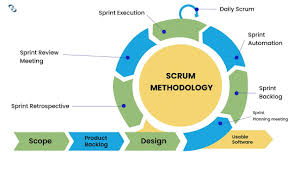
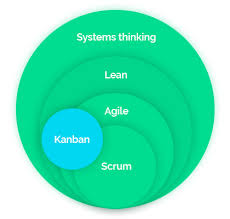

## Agile Methodologies

> __Definition:__
> Agile is iterative, flexible, and adaptive, focusing on collaboration and customer feedback.

#### Key Features:

- Small, incremental deliveries.
- Continuous stakeholder involvement.
- Changes welcome at any stage.

- ### Diagram

    

### Popular Agile Frameworks:

#### Scrum

- Roles: Product Owner, Scrum Master, Team.
- Work is divided into Sprints (2–4 weeks).
- Daily stand-up meetings for progress updates.

- ### Diagram

    

#### Kanban

- Visual workflow management (using boards/cards).
- Focuses on continuous delivery, limiting work in progress.

### Diagram

    

#### Extreme Programming (XP)

- Emphasizes test-driven development (TDD), pair programming, and frequent releases.

__Example:__ Modern SaaS applications (like Spotify or Zoom) constantly release updates based on user feedback.

#### Pros:
- Flexible & adaptive to change.
- Continuous delivery keeps users happy.

#### Cons:
- Less predictable timelines.
- Requires disciplined team collaboration.

## DevOps & Continuous Delivery

> __Definition:__
> DevOps is a culture and set of practices that combines development (Dev) and operations (Ops) for faster and reliable delivery.

#### Core Principles:

- Automation of builds, testing, deployment (CI/CD pipelines).
- Monitoring and feedback loops.
- Collaboration between development & operations teams.

### Continuous Delivery (CD):
- Automatically deploy code to production after passing tests.
- Ensures software is always in a releasable state.

__Example:__ Amazon or Netflix deploy code changes hundreds of times per day using DevOps pipelines.

### Diagram

    

#### Pros:
- Faster time to market.
- Higher software quality & reliability.

#### Cons:
- Requires skilled engineers & proper tooling.
- Initial setup can be expensive.

